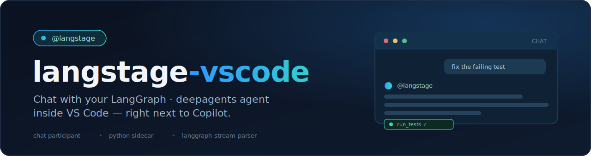

<p align="center">
  
</p>

# deepagent-vscode

Chat with your own **LangGraph / deepagents** agent from inside VS Code — in the
same chat panel as Copilot — via the `@deepagent` chat participant.

It has two parts in one repo:

- **`extension/`** — a TypeScript VS Code extension that registers the
  `@deepagent` chat participant and renders agent output in the chat view.
- **`deepagent_vscode/`** — a small Python **stdio sidecar** that loads your
  agent and streams its events. Built on
  [`langgraph-stream-parser`](https://github.com/dkedar7/langgraph-stream-parser),
  so it speaks the same typed event vocabulary as the other deep-agent surfaces
  (`cowork-dash`, `deepagent-lab`, `deepagent-code`).

```
┌─ VS Code chat panel ────────────────────────────┐
│  @deepagent  (TypeScript extension)              │
│        │  spawns                                 │
│        ▼                                          │
│  python -m deepagent_vscode   (stdio sidecar)    │
│        │  NDJSON over stdin/stdout               │
│        ▼                                          │
│  your LangGraph / deepagents agent               │
└──────────────────────────────────────────────────┘
```

> **Status: early.** The extension is not yet on the VS Code Marketplace (run
> it from source for now), and interactive approval of human-in-the-loop
> interrupts is not wired into the chat UI yet (the sidecar already supports
> the round-trip).

## One agent, every surface

deepagent-vscode is the VS Code surface of the **deep-agent family**: write your agent once — any LangGraph `CompiledGraph` — and run it on every surface with the same spec string (`module:attr` or `path/to/file.py:attr`), the same `deepagents.toml` config file, and the same `DEEPAGENT_*` environment variables.

| Surface | Package | Try it |
|---|---|---|
| Web app | [cowork-dash](https://github.com/dkedar7/cowork-dash) | `cowork-dash run --agent my_agent.py:graph` |
| JupyterLab | [deepagent-lab](https://github.com/dkedar7/deepagent-lab) | `pip install deepagent-lab`, then the chat sidebar in `jupyter lab` |
| Terminal | [deepagent-code](https://github.com/dkedar7/deepagent-code) | `deepagent-code -a my_agent.py:graph` |
| VS Code | deepagent-vscode | **you are here** |
| Reference agent | [deepagent-hermes](https://github.com/dkedar7/deepagent-hermes) | `DEEPAGENT_AGENT_SPEC=deepagent_hermes.agent:graph` on any surface |
| Shared core | [langgraph-stream-parser](https://github.com/dkedar7/langgraph-stream-parser) | typed events + config resolver behind every surface |

## Install

### Sidecar (Python)

```bash
pip install deepagent-vscode
# or, for a quick try with the bundled default agent:
pip install "deepagent-vscode[demo]"
```

### Extension (from source, until it's on the Marketplace)

```bash
cd extension
npm install
npm run compile
```

Then press **F5** in VS Code (with the `extension/` folder open) to launch an
Extension Development Host with `@deepagent` available.

## Configure

In VS Code settings:

| Setting | Description | Default |
|---|---|---|
| `deepagent.agentSpec` | Your agent, as `path/to/agent.py:graph` or `module:graph` | _(falls back to `DEEPAGENT_AGENT_SPEC` / `deepagents.toml`)_ |
| `deepagent.pythonPath` | Python interpreter that has `deepagent-vscode` installed | `python` |

The sidecar resolves its configuration through the family-standard chain —
**defaults < `deepagents.toml` (global + project) < `DEEPAGENT_*` env < CLI
flags** — so a project with `[agent] spec = "my_agent.py:graph"` in its
`deepagents.toml` needs no VS Code setting at all. Inspect the resolved values:

```bash
deepagent-vscode-sidecar --show-config
```

Your agent is any LangGraph `CompiledGraph` (e.g. from `deepagents`), exported
under the name in the spec:

```python
# my_agent.py
from deepagents import create_deep_agent
graph = create_deep_agent(...)   # -> deepagent.agentSpec = "my_agent.py:graph"
```

## Usage

Open the chat panel and start a message with `@deepagent`:

```
@deepagent summarize the failing tests in this repo and propose a fix
```

The extension streams the agent's content, tool calls, reasoning, and todo
updates into the chat response.

## Sidecar protocol

The extension talks to the sidecar over newline-delimited JSON. You can drive it
directly for testing:

```bash
DEEPAGENT_AGENT_SPEC=./my_agent.py:graph python -m deepagent_vscode

# or with no agent and no API key at all:
python -m deepagent_vscode --demo
```

**Commands** (client → sidecar), one JSON object per line:

```jsonc
{"type": "message",  "session_id": "s1", "content": "hello"}
{"type": "decision", "session_id": "s1", "decisions": [{"type": "approve"}]}
{"type": "shutdown"}
```

**Events** (sidecar → client) — the `event.to_dict()` shapes from
`langgraph-stream-parser`, plus a few protocol frames:

```jsonc
{"type": "ready"}                          // emitted once at startup
{"type": "ack", "ref": "message"}          // command accepted
{"type": "content", "content": "..."}      // assistant text
{"type": "tool_start", "name": "...", ...} // tool call
{"type": "tool_end", "name": "...", ...}   // tool result
{"type": "interrupt", "action_requests": [...]}  // human-in-the-loop
{"type": "complete"}                       // turn finished
{"type": "turn_end", "session_id": "s1"}
```

## Development

```bash
# Sidecar
pip install -e ".[dev]"
pytest

# Extension
cd extension
npm install
npm run compile
```

## License

MIT
