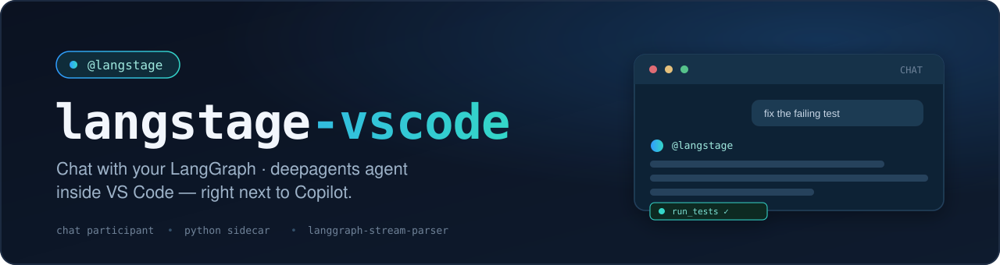

<p align="center">
  
</p>

# langstage-vscode

Chat with your own **LangGraph** agent from inside VS Code — in the
same chat panel as Copilot — via the `@langstage` chat participant.

> Renamed from **deepagent-vscode** (the old package name now just installs
> this one; `python -m deepagent_vscode` and the old sidecar command still work).

It has two parts in one repo:

- **`extension/`** — a TypeScript VS Code extension that registers the
  `@langstage` chat participant and renders agent output in the chat view.
- **`langstage_vscode/`** — a small Python **stdio sidecar** that loads your
  agent and streams its events. Built on
  [`langstage-core`](https://github.com/dkedar7/langstage-core),
  so it streams the same AG-UI frame vocabulary as the other LangStage stages
  (`langstage`, `langstage-jupyter`, `langstage-cli`).

```
┌─ VS Code chat panel ────────────────────────────┐
│  @langstage  (TypeScript extension)              │
│        │  spawns                                 │
│        ▼                                          │
│  python -m langstage_vscode   (stdio sidecar)    │
│        │  NDJSON over stdin/stdout               │
│        ▼                                          │
│  your LangGraph / deepagents agent               │
└──────────────────────────────────────────────────┘
```

> **Status: early.** The extension is not yet on the VS Code Marketplace: install
> the `.vsix` that CI builds (see [Install](#extension)), or run it from source.

## Every stage for your LangGraph agent

langstage-vscode is the VS Code stage of the **LangStage family**: write your agent once — any LangGraph `CompiledGraph` — and run it on every stage with the same spec string (`module:attr` or `path/to/file.py:attr`), the same `langstage.toml` config file, and the same `LANGSTAGE_*` environment variables.

| Stage | Package | Try it |
|---|---|---|
| Web app | [langstage](https://github.com/dkedar7/langstage) | `langstage run --agent my_agent.py:graph` |
| JupyterLab | [langstage-jupyter](https://github.com/dkedar7/langstage-jupyter) | `pip install langstage-jupyter`, then the chat sidebar in `jupyter lab` |
| Terminal | [langstage-cli](https://github.com/dkedar7/langstage-cli) | `langstage-cli -a my_agent.py:graph` |
| VS Code | langstage-vscode | **you are here** |
| Reference agent | [langstage-hermes](https://github.com/dkedar7/langstage-hermes) | `LANGSTAGE_AGENT_SPEC=langstage_hermes.agent:graph` on any stage |
| Shared core | [langstage-core](https://github.com/dkedar7/langstage-core) | AG-UI streaming bridge + config resolver behind every stage |

📖 **Full documentation:** <https://dkedar7.github.io/langstage-docs/>

### Serve over AG-UI

The sidecar already streams every turn through the in-process AG-UI adapter. Your
agent — any LangGraph `CompiledGraph` — can also be served over the
[AG-UI protocol](https://github.com/dkedar7/langstage-core) as a standalone HTTP
endpoint, without changing your agent code:

```bash
pip install "langstage-core[agui]"
langstage-agui --agent my_agent.py:graph
```

## Install

### Sidecar (Python)

```bash
pip install langstage-vscode
```

`--demo` (the keyless echo stub) runs on this base install — since 0.5.0 the base
deps pull the AG-UI runtime, which brings `langgraph`, so no extra is needed.
Pass **`--demo=tools`** for the rich-frame demo that exercises
`tool_start`/`tool_end`/`reasoning`/`interrupt` keyless — the extension's headline
rendering surface, without an agent or API key (parity with `langstage-agui
--demo=tools`).

### Extension

The extension is not on the Marketplace yet. Every CI run builds an installable
`.vsix`: open the latest [CI run on `main`](https://github.com/dkedar7/langstage-vscode/actions/workflows/ci.yml?query=branch%3Amain),
download the **`langstage-vscode-vsix`** artifact, unzip it, and install it (VS Code
1.95 or newer):

```bash
code --install-extension langstage-vscode-<version>.vsix
```

Or build the same file yourself:

```bash
cd extension
npm install
npm run package        # writes langstage-vscode-<version>.vsix
```

To work on the extension, run `npm run compile` and press **F5** in VS Code (with the
`extension/` folder open) to launch an Extension Development Host with the LangStage panel (and `@langstage`, where
the chat view exists) available.

## Configure

In VS Code settings:

| Setting | Description | Default |
|---|---|---|
| `langstage.agentSpec` | Your agent, as `path/to/agent.py:graph` or `module:graph` | _(falls back to `LANGSTAGE_AGENT_SPEC` / `langstage.toml`)_ |
| `langstage.pythonPath` | Python interpreter that has `langstage-vscode` installed | `python` |

The sidecar resolves its configuration through the family-standard chain —
**defaults < `langstage.toml` (global + project) < `LANGSTAGE_*` env < CLI
flags** — so a project with `[agent] spec = "my_agent.py:graph"` in its
`langstage.toml` needs no VS Code setting at all. Inspect the resolved values:

```bash
langstage-vscode-sidecar --show-config
```

A relative path in a `langstage.toml` (`[agent] spec = "agent.py:graph"`, `[workspace] root`)
resolves against **that file's directory**, so the sidecar behaves the same from any
subdirectory of the project; a relative `--agent` / `LANGSTAGE_AGENT_SPEC` resolves against the
directory you launched from. A leading `~` expands everywhere, and stray whitespace around the
spec is ignored. A `[configurable]` table is forwarded verbatim to your graph's
`config["configurable"]` on every turn and shown by `--show-config`:

```toml
[agent]
spec = "my_agent.py:graph"

[configurable]
model = "claude-sonnet-4-5"   # read in a node via config["configurable"]["model"]
```

`--show-config --json` lists every config file it read under `toml.paths` (the global
`~/.langstage/config.toml` first), and reports a `langstage.toml` that exists but doesn't parse
as `"malformed": true` with the parse error, rather than as absent.

Preflight the interpreter and your agent before wiring up chat — `--selfcheck`
(alias `--smoke`) loads the configured agent (or the demo stub), asserts it's a
runnable graph, drives one turn, and exits `0` (healthy) / non-zero with a precise
message (add `--json` for a machine-readable verdict). If that turn pauses on a
human-in-the-loop interrupt instead of replying, the verdict is `PAUSED:` (`"ok": false,
"interrupt": true` in `--json`) with exit `2`, the code `--message` uses for a pause.
In the chat, such an agent asks for your decision on its first `@langstage` turn (see
[Answering an interrupt](#answering-an-interrupt-from-the-chat)):

```bash
langstage-vscode-sidecar --selfcheck                       # validate the runtime via the demo stub
langstage-vscode-sidecar --selfcheck --agent ./my.py:graph # validate the configured agent
```

With no agent configured, a pass says it only validated the runtime with the demo stub
(`"demo_fallback": true` in `--json`). If a `langstage.toml` key that looks like a typo'd
spec was ignored (`[agent] specc = ...`, an `[agents]` table), `--selfcheck` fails and
names the key rather than validating the stub in your agent's place.

`--selfcheck` answers "is the runtime healthy?"; **`--message`** answers "what does my
agent actually *say*?" — it drives one turn with your prompt and prints the reply, then
exits (no NDJSON + `shutdown` to hand-craft). Add `--json` to get the raw event frames
instead of the assembled text:

```bash
langstage-vscode-sidecar --demo --message "hello"                       # prints the reply
langstage-vscode-sidecar --agent ./my.py:graph --message "summarize the repo"
langstage-vscode-sidecar --agent ./my.py:graph --message "hi" --json    # raw event frames
```

Bare `--demo` is the echo stub (only `content` frames); **`--demo=tools`** serves the
rich-frame demo — a keyless way to see every non-content frame the extension renders,
no agent and no API key. Its trigger phrases route to each frame type:

```bash
langstage-vscode-sidecar --demo=tools --message "please use a tool" --json  # tool_start/tool_end/extraction
langstage-vscode-sidecar --demo=tools --message "think about it" --json     # reasoning frames
langstage-vscode-sidecar --demo=tools --message "ask me first"              # HITL interrupt, exits 2
langstage-vscode-sidecar --demo=tools --repl                                # answer the interrupt inline
```

`--message` answers "what does my agent say *once*?"; **`--repl`** answers "does it
*remember*?" — the multi-turn companion to `--message`. It reads one prompt per line and
drives a turn, but keeps **one long-lived session** (a single `session_id`, so a single
LangGraph `thread_id`) alive for every turn — the same per-conversation shape the VS Code
extension uses — so your agent's memory persists across turns. That makes the memory
behavior below verifiable from the CLI in ten seconds: tell it your name, ask on the next
line. Exit with **Ctrl-D** (EOF) or a `:quit` line; `--json` streams
the raw event frames instead of the assembled text, just like `--message`:

```bash
langstage-vscode-sidecar --agent ./my.py:graph --repl
> my name is Kedar
...
> what is my name?
...
> :quit
```

Your agent will recall the first line on the second **even if you never compiled in a
checkpointer** — within one sidecar process the sidecar auto-attaches an in-memory checkpointer
to any graph that lacks one, so `--repl` (one process, one `session_id`) verifies in-process
memory and catches a wrong-`session_id` mistake before wiring up the extension. What it can't
prove is *durable* memory: that in-memory state is lost when the process ends, so persistence
across separate processes still needs a persistent checkpointer (see the memory note under
[Sidecar protocol](#sidecar-protocol)).

Both turn-drivers are **interrupt-aware**. If your agent pauses on a human-in-the-loop
`interrupt(...)` (the common `deepagents` / LangGraph approval pattern), the turn is no longer
a silent blank — the pending action and the decisions it allows are surfaced on **stderr**
(stdout stays the clean reply channel), and one-shot `--message` exits with a distinct code
**`2`** so an interrupt is scriptable, distinct from a clean reply (`0`) or an error (`1`):

```console
$ langstage-vscode-sidecar --agent ./hitl.py:graph --message "do it"
interrupt: agent paused awaiting a decision
  action: confirm   allowed: reject | edit | respond | approve
  resume by sending a `decision` command (add --json to see the full request)
$ echo $?
2
```

With `--json`, the raw `{"type": "interrupt", ...}` frame streams on stdout, so a consumer keys
on it directly.

**`--repl` can also *answer* the interrupt**, completing the `interrupt` → `decision` round-trip
without hand-writing the stdio protocol. When a turn ends on an interrupt, the session enters
**decision mode**: the next line becomes a `decision` on the *same* session, so it resumes that
thread's pending interrupt.

```console
$ printf 'do it\napprove\n:quit\n' | langstage-vscode-sidecar --agent ./hitl.py:graph --repl
interrupt: agent paused awaiting a decision
  action: confirm   allowed: reject | edit | respond | approve
  answer it here: `:decision <verb>` (or a bare `<verb>`) using a verb above
  payloads: reject [<text>] | edit <json> | respond <text>
resumed with: {'decisions': [{'type': 'approve'}]}
```

- Type **`:decision <verb>`** (same `:`-prefixed namespace as `:quit`), or just the **bare verb** —
  a bare verb is only read as a decision *while an interrupt is pending*; the rest of the time
  `approve` is ordinary chat text.
- The verbs come from **that interrupt's own `allowed_decisions`**, so an approval-only agent
  offers and accepts exactly `reject | approve` (the legacy aliases below are accepted too). Payloads follow the LangChain HITL decisions:
  `approve`, `reject [<text>]`, `respond <text>`, `edit <json>` (free text becomes `message`, a
  JSON object is merged in, e.g. `edit {"edited_action": {"name": "confirm", "args": {}}}`).
- While an interrupt is pending, a line that **isn't** a valid decision is **refused on stderr and
  re-prompted** with the interrupt left pending — it is never silently sent as a new message (which
  would just re-interrupt and look accepted) and never swallowed. `:quit` is always the way out.
- `--json` composes: the answer line emits `ack` with `"ref": "decision"`, so the trace reads
  `ready → ack message → interrupt → complete → turn_end → ack decision → content → complete → turn_end`.
  (Both turns emit `complete` — an interrupt turn is `interrupt → complete → turn_end`; it is
  paused, not finished-with-a-reply, so detect the pause via the `interrupt` frame, not the
  absence of `complete`.)
- **`--repl` exit codes:** `0` on a clean session (including an interrupt that *was* answered),
  `1` if the agent could not start at all, and **`2`** if the session ends with an interrupt still
  unanswered — the same "paused awaiting a decision" signal `--message` uses.

You can still drive `decision` over the raw stdio protocol directly
(`{"type": "decision", "session_id": "...", "decisions": [{"type": "approve"}]}`). That is what
the VS Code extension sends when you click a decision button in the chat (see
[Answering an interrupt from the chat](#answering-an-interrupt-from-the-chat)).

Your agent is any LangGraph `CompiledGraph` (e.g. from `deepagents`), exported
under the name in the spec:

```python
# my_agent.py
from deepagents import create_deep_agent
graph = create_deep_agent(...)   # -> langstage.agentSpec = "my_agent.py:graph"
```

### Exit codes

The sidecar uses the LangStage family exit codes
([core ADR 0007](https://github.com/dkedar7/langstage-core/blob/main/docs/adr/0007-family-exit-codes.md)),
the same on every surface:

| Code | Meaning |
|---|---|
| `0` | success: `--selfcheck` healthy, `--message` replied, `--repl` / the stdio loop ended cleanly, `--show-config` printed |
| `1` | failure: no agent spec, the agent failed to load, an unusable `--workspace`, an error frame, a failed `--selfcheck` |
| `2` | paused on a human-in-the-loop interrupt (`--selfcheck`, `--message`, or `--repl` ending with one unanswered) |
| `64` | usage error: an unknown flag or bad value (`--demo=bogus`), or conflicting flags (`--demo` with `--agent`, `--repl` with `--message`) |

`2` means only "paused". Usage errors exit `64` rather than argparse's default `2`, so a
typo'd flag in a script can't read as a pause.

## Usage

### The LangStage panel (preview)

Extension 0.5.0 added the **LangStage panel**: the extension's own chat view, in the activity
bar (the LangStage icon), or via **LangStage: Open the LangStage panel** in the command
palette. It needs nothing but the editor and the sidecar, so it works **with or without
Copilot**, in VS Code, Cursor, VSCodium, Windsurf and code-server
([ADR 0001](docs/adr/0001-standalone-panel.md)).


*Recorded by `npm run record` (`extension/test/record/`): the real panel bundle in the
webview harness, themed like VS Code's Dark Modern, driven through the real host logic
against the real sidecar running `--demo=tools`. No Copilot, no API key.*

- Replies stream in as markdown. Each assistant message (`message_id`) is its own block.
- Tool calls are collapsible cards with the arguments, the result, the status and the
  duration. Reasoning is a collapsed block, apart from the reply. A `write_todos` plan is
  one live **Tasks** checklist at the top, updated in place.
- **Stop** cancels the turn cooperatively: the agent keeps its memory of the conversation.
- **Approvals (0.6.0).** When the agent pauses on a human-in-the-loop interrupt, the panel
  shows an approval card with the action and its arguments, and one button per decision the
  interrupt allows: **Approve**, **Reject** (with an optional reason), **Respond** (answer in
  words), **Edit** (the arguments as JSON, checked before sending), and any custom verb the
  graph advertises. Legacy spellings (`accept`, `ignore`, `response`) work as in core's
  `normalize_decision`. The sidecar stays the authority: if it refuses an answer, the card
  stays live and shows why. While a conversation is paused, the message box asks you to
  answer the request first.
- **Conversations (0.6.0).** The title at the top opens the conversation list: new (**+**),
  switch, rename and delete. Each conversation has its own session, so the agent's memory is
  never shared between them. The sidecar runs one turn at a time, so a message sent in one
  conversation while another is streaming is shown as *queued* and runs next; **Stop** stops
  only its own conversation.
- **Transcripts persist per workspace** (in the extension's workspace storage, on this
  machine, not synced) and come back after a window reload. The agent process is new after a
  reload, so the panel marks where its memory stops: *"The agent may not remember the
  conversation above"*. With the default in-memory checkpointer it doesn't; configure a
  durable checkpointer to keep memory across restarts. A request that was still waiting for
  your decision can't be answered after a reload; send a new message instead.
- The status line shows the sidecar starting, ready, or failed with its startup error. With no
  agent configured it offers **Open settings** and **Try the demo** (the keyless
  `--demo=tools` agent, for that session only).
- Agent output is untrusted: raw HTML is never rendered, and a link opens only after you
  confirm it. The panel talks to the sidecar over the extension host's stdio pipe; it opens
  no network port.

The panel runs its own sidecar, separate from the `@langstage` participant's, so the two
don't share conversations. It is still a **preview**: Marketplace and Open VSX publishing
come next ([build plan](docs/plan-standalone-panel.md), M6). The extension is disabled in
untrusted (Restricted Mode) workspaces, because running your agent executes workspace code.

### For Copilot users: the `@langstage` chat participant

Where the editor has a chat view (VS Code with Copilot), open it and start a message with
`@langstage`:

```
@langstage summarize the failing tests in this repo and propose a fix
```

The extension streams the agent's content, tool calls, reasoning, and todo
updates (a `write_todos` call renders as a **Tasks** checklist) into the chat response.

### Answering an interrupt from the chat

When the agent pauses on a human-in-the-loop interrupt (a `HumanInTheLoopMiddleware`
approval, or any `interrupt(...)`), the response shows what it wants to do (each action,
its description, and its arguments) and a button for each decision the interrupt allows:

| Button | Same as typing | Sends |
|---|---|---|
| **Approve** | `@langstage /approve` | `{"type": "approve"}` |
| **Reject** | `@langstage /reject [reason]` | `{"type": "reject"}`, plus `"message"` if you give a reason |
| **Respond…** | `@langstage /respond <text>` | `{"type": "respond", "message": "<text>"}` |
| **Edit…** | `@langstage /edit <json>` | the JSON object merged into `{"type": "edit"}`, e.g. `{"edited_action": {"name": "...", "args": {...}}}` |

**Approve** and **Reject** send at once. **Respond…** and **Edit…** put the command in
the chat input so you can type the text. The answer is a `decision` on the same
conversation's session, and the resumed turn streams into the chat like any other reply.

- Only the verbs in the interrupt's `allowed_decisions` get a button, and a command for
  any other verb is refused before it is sent. The sidecar checks every decision again
  with langstage-core's `normalize_decision`. A legacy interrupt that lists `accept`,
  `ignore` or `response` is answered with that spelling. A custom verb has no button; it
  is listed and can be answered from `--repl`.
- An interrupt that asks about several actions at once gets the same decision for each.
- While the agent is paused, a plain message is not sent (it could not reach the agent).
  The chat shows the buttons again instead.
- The pending interrupt lives in the sidecar process. If that process restarts (a
  settings change, a reload) before you answer, the decision is refused with
  `no interrupt pending`; start a new message.

## Sidecar protocol

The extension talks to the sidecar over newline-delimited JSON. You can drive it
directly for testing:

```bash
LANGSTAGE_AGENT_SPEC=./my_agent.py:graph python -m langstage_vscode

# or with no agent and no API key at all — the keyless stub runs on a base install
python -m langstage_vscode --demo

# or exercise tool-call, reasoning, and interrupt frames keyless (no agent, no API key)
python -m langstage_vscode --demo=tools
```

**Commands** (client → sidecar), one JSON object per line:

```jsonc
{"type": "message",  "session_id": "s1", "content": "hello"}
{"type": "decision", "session_id": "s1", "decisions": [{"type": "approve"}]}
{"type": "cancel",   "session_id": "s1"}   // abort the in-flight turn, keep the session
{"type": "shutdown"}
```

**Decision verbs.** Each entry in `decisions` needs a string `type`, and that verb must
be one the pending `interrupt` frame lists in `allowed_decisions`. The advertised verbs
are LangChain's HITL decisions: `approve`, `edit`, `reject`, `respond`. The legacy
LangGraph `HumanResponse` verbs are accepted as aliases, in any case:

| Alias      | Means     |
|------------|-----------|
| `accept`   | `approve` |
| `ignore`   | `reject`  |
| `response` | `respond` |

So `accept` answers an interrupt that allows `approve`, and `ignore` is refused by one
that doesn't allow `reject`. The sidecar checks each verb with langstage-core's
`normalize_decision`, the same check `--repl` uses, so both paths accept and refuse the
same input (gh #117). A decision whose verb is missing or not allowed is refused with
`error → turn_end` and **no `ack`**, and the interrupt stays pending, so a valid
`decision` can still answer it. If any entry in `decisions` is refused, none are sent.
An accepted decision reaches the graph as sent: core rewrites an alias to the canonical
verb for a `HumanInTheLoopMiddleware` interrupt, which needs it, and hands any other
interrupt the verb unchanged.

A **`cancel`** stops the turn currently streaming for that `session_id` **cooperatively** —
it emits a distinct `cancelled` frame (neither `complete` nor `error`) then `turn_end`, and
**leaves the process, the session, and its in-process checkpointer alive**, so the next
`message` on the same `session_id` resumes with memory intact. A cancelled `message` turn
is also rolled back (gh #106): the thread returns to its checkpoint from before that turn,
so the cancelled prompt doesn't stay in the agent's history with no reply after it. (This
needs a checkpointer the sidecar can read synchronously, such as the default in-memory
one. With an async-only checkpointer the thread is left as it was.) That is the difference from
killing the sidecar to stop a turn, which throws the conversation's memory away. A `cancel`
with no turn in flight for the session is answered with an `error` frame
(`no turn in progress for session '…'`), consistent with the `decision`/`message` guards.

**Events** (sidecar → client): langstage-core's AG-UI event-wire frames (the same frame
vocabulary every LangStage stage streams), plus a few protocol frames:

```jsonc
{"type": "ready"}                          // emitted once at startup
{"type": "ack", "ref": "message"}          // command accepted ("ref": "decision" for a decision)
{"type": "content", "content": "...", "role": "assistant", "node": "...", "message_id": "..."}
                                           // assistant text; a new message_id = a new
                                           // assistant message (render a paragraph break)
{"type": "reasoning", "content": "...", "node": "..."}
                                           // model reasoning, kept separate from content
{"type": "tool_start", "id": "...", "name": "...", "args": {...}, "node": "..."}  // tool call
{"type": "tool_end", "id": "...", "name": "...", "result": "...", "status": "success",
 "error_message": null, "duration_ms": 0}  // tool result ("status": "error" if it failed)
{"type": "extraction", "tool_name": "write_todos", "extracted_type": "todos", "data": [...]}
                                           // structured data from a tool result; the
                                           // extension renders "todos" as a Tasks checklist
{"type": "interrupt", "action_requests": [...], "review_configs": [...],
 "allowed_decisions": ["approve", "reject", ...]}  // human-in-the-loop
{"type": "complete", "outcome": "complete"} // turn finished ("interrupted" if it paused
                                           // on an interrupt) — see the note below
{"type": "cancelled", "session_id": "s1"}  // turn stopped by a `cancel` (not complete/error)
{"type": "error", "error": "..."}          // protocol error (bad/unknown command)
                                           // OR an exception raised by the agent.
                                           // On agent failure the turn emits this
                                           // INSTEAD of "complete", then "turn_end".
                                           // With debug on, it also carries "traceback".
{"type": "turn_end", "session_id": "s1"}
```

The sidecar wires core's `TodoExtractor` into every turn, so an agent that calls
`write_todos` (the `deepagents` planning tool) emits the `todos` `extraction` frame above.
`--demo=tools` wires the demo's own extractor instead (`"extracted_type": "demo_fact"`).
A client should ignore a frame type or key it doesn't know: new keys are additive.

> A client must handle `error`: a malformed/unknown command, a `message` with no
> `content`, an invalid `decision` (including a well-formed one sent when the session
> has no pending interrupt to resume, or one whose verb the interrupt doesn't allow),
> **and** an agent crashing mid-turn all emit an
> `error` frame. On the agent-failure path there is no `complete` — the sequence
> is `ack → error → turn_end`, with any content earlier nodes already produced
> streamed before the `error` — so don't key turn-completion off `complete` alone.
>
> A **rejected** command is still a (zero-length) turn: a `message` with no `content`,
> a malformed `decision`, a `decision` with no pending interrupt, or one with a verb the
> interrupt doesn't allow emits
> `error → turn_end` — **no `ack`**, since nothing ran — so a client that waits for
> `turn_end` always stops waiting (gh #118). `turn_end` is the one frame every
> `message`/`decision` is guaranteed to end with. The same `error → turn_end` shape
> answers a `message` whose `content` isn't a string (gh #113), and a `message` sent to
> a session that is **paused on an interrupt** (gh #134): a new message would not
> resume it (the turn would just re-interrupt and the message would never reach the
> agent), so answer the interrupt with a `decision` instead. A `message`/`decision`
> whose `session_id` isn't a string is rejected the same way, but its `turn_end`
> carries **no** `session_id` (the bad value is not echoed back); a `cancel` with a
> non-string `session_id` gets a bare `error` (gh #122).
>
> **Encoding.** Commands are read as **UTF-8**, whatever the platform's locale
> encoding (gh #119). A line that isn't valid UTF-8 gets a bare `error` frame, like
> invalid JSON, and the loop keeps serving.
>
> **Startup failures** come *before* `ready`: with no agent spec, a spec that fails to
> load, or a workspace root that isn't a directory (gh #121), the sidecar writes one
> `error` frame with **no** `ready` and exits `1`. A client should show that frame's
> `error` text; the extension does (gh #131).
>
> Two more terminal shapes are *not* `complete`. An **interrupt** turn emits
> `interrupt → complete → turn_end`: it *does* still emit `complete`, but the agent
> produced no reply — it is paused awaiting a decision, so detect the pause via the
> `interrupt` frame, not by the presence of `complete`. A **cancelled** turn (a client
> `cancel`) emits `cancelled → turn_end` with **no** `complete` at all — a cancelled turn
> is neither `complete` nor `error`.

> **`session_id` and conversational memory.** The sidecar maps each
> `session_id` to a LangGraph `thread_id` in the run config, and attaches an
> **in-memory checkpointer** to any graph that was compiled without one — the
> AG-UI adapter the sidecar streams through needs threaded state, and this avoids
> a hard "No checkpointer set" crash. So within **one sidecar process**, multi-turn
> memory across messages with the same `session_id` works for **any** graph — even
> a plain `create_react_agent` with no checkpointer of its own — because the sidecar
> supplies the missing checkpointer for you, keyed by `session_id` / `thread_id`.
> Compiling your own (`graph.compile(checkpointer=...)`, or
> `create_deep_agent(..., checkpointer=...)`) chooses *which* checkpointer is used,
> not *whether* one turn remembers the next in-process.
>
> The real distinction is **in-process vs. cross-process**. The auto-attached
> checkpointer — like any `MemorySaver` — lives only in that process, so its memory
> is lost when the process ends. The **VS Code extension keeps one sidecar process
> alive per conversation** — it spawns the sidecar on the first `@langstage` message
> and reuses that same process for every following turn (gh #54) — so that in-process
> memory persists across turns in chat, not just when you drive the stdio protocol by
> hand. Each chat conversation gets its **own `session_id`** (a random id minted on its
> first turn and carried in the chat result metadata), so two conversations never share
> a thread — not when you resume an earlier chat, and not across restarts with a
> durable checkpointer (gh #133). The process is restarted on a config change
> (interpreter / agent spec) and when you start a new chat; resuming an older chat
> after that starts it on a clean in-process thread (a durable checkpointer keeps its
> history). If you drive the sidecar yourself, keep **one process**
> alive and send each turn to it — a fresh process per message gets a fresh in-memory
> checkpointer and forgets the prior turn. What survives **across separate processes**
> (durable memory) is a **persistent** checkpointer (`SqliteSaver`, `PostgresSaver`,
> …) keyed by `thread_id` — the one thing the sidecar's in-memory default is *not*.
> The **`--repl`** flag (see [Configure](#configure)) drives exactly one process with
> one session across turns, so you can verify this in-process memory behavior from the
> CLI without hand-crafting the protocol.

## Development

```bash
# Sidecar
pip install -e ".[dev]"
pytest

# Extension
cd extension
npm install
npm run compile
npm test               # unit tests: sidecar client, panel host, store, protocol, webview reducer
npx playwright install chromium
LANGSTAGE_PYTHON=python npm run test:e2e    # the panel in Chromium against the real sidecar
LANGSTAGE_PYTHON=python npm run test:smoke  # the extension in a real VS Code (xvfb-run on Linux)
LANGSTAGE_PYTHON=python npm run record      # re-record docs/assets/panel-demo.{webm,gif} (needs ffmpeg)
npm run watch:webview  # rebuild the panel's webview bundle on change
npm run package        # build the .vsix
```

## License

MIT
